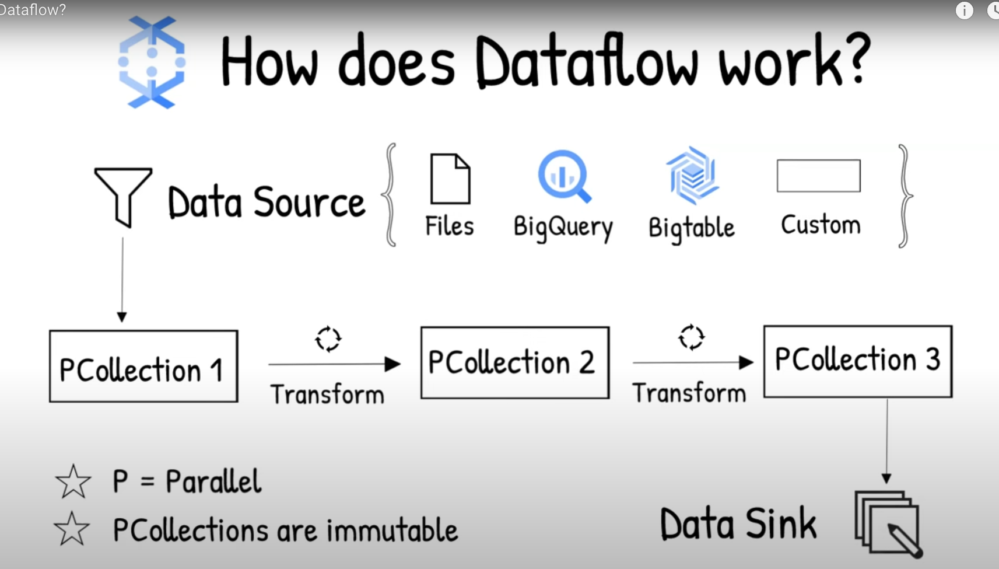
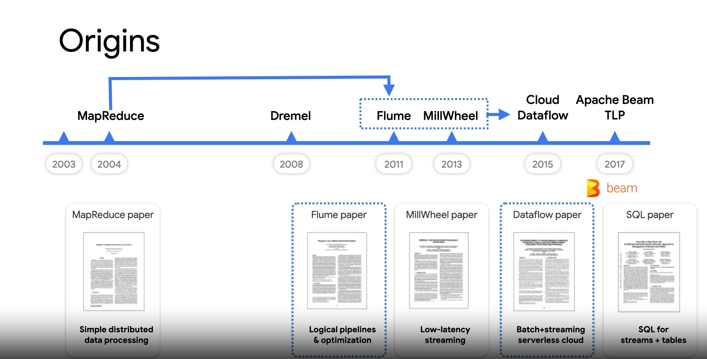
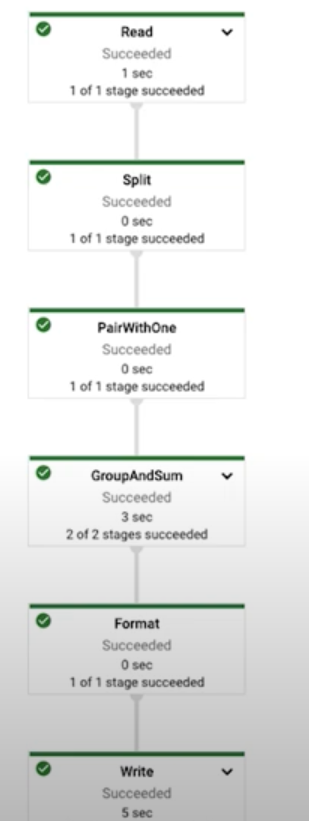

What is dataflow? - https://www.youtube.com/watch?v=KalJ0VuEM7s

### What is Dataflow?

- Serverless service
- Supports both streaming and batch processing
- Jobs written using open source Apache Beam libraries

### How does Dataflow work?

Read data -> Transform data -> Write data

- Data is read from the source called PCollection. P stands for Parallel
- Then it performs one or more operations on the PCollection called Transforms
- Each time it runs a transform a new PCollection is created because Pcollections are immutable
- After all of the transforms are executed, the pipeline writes the final PCollection to an
  external sink



### What is Apache Beam?

https://www.youtube.com/watch?v=65lmwL7rSy4

- Unified tool for both Batch and Streaming

  

Runners

- Cloud dataflow
- Apache flink
- Apache spark
- Apache Samza

- Pipeline contains multiple stages which are DAGs -> Directed Acyclic Graphs

### Core primitives

**PCollection**

- immutable collection of values
- Beam transforms use PCollection objects as inputs and outputs

**PTransform**

- an operation in a pipeline
- processing logic as a function object applied to each element of one or more input PCollection(s)

**Pipeline**

- Directed Acyclic Graph (DAG) of data transformations
- Can include
- multiple input sources and output sinks
- operations/PTransforms that can read and output PCollections

**Windows**

- Ability to group data using Windows
- A Window subdivides a PCollection by timestamp (group elements by timestamp)
- Types
  - Fixed Windows
  - Sliding Windows
  - Session Windows

**Processing time vs event time**

- Handling late data is done by watermarking

WordCount example in Apache Beam
https://www.youtube.com/watch?v=RTIOW1fIhkM

```python
with beam.Pipeline(options=pipeline_options) as p:
  lines = p | 'Read' >> ReadFromText(known_args.input)

  counts = (
    lines
    | 'Split' >> (beam.ParDo(WordExtractingDoFn()).with_output_types(str))
    | 'PairWithOne' >> beam.Map(lambda x: (x, 1))
    | 'GrooupAndSum' >> beam.CombinePerKey(sum))

  def format_result(word, count):
    return '%s: %d' % (word, count)

  output = counts | 'Format' >> beam.MapTuple(format_result)
  output | 'Write' >> WriteToText(known_args.output)
```



### Hoow to process stream data on Apache Beam

https://www.youtube.com/watch?v=oJ-LueBvOcM&list=PLIivdWyY5sqIEiHGunZXg_yoS7unlHNJt&index=3
