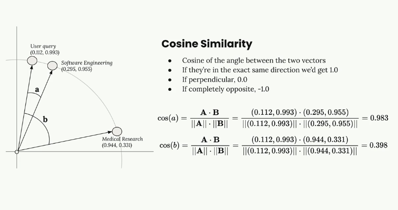
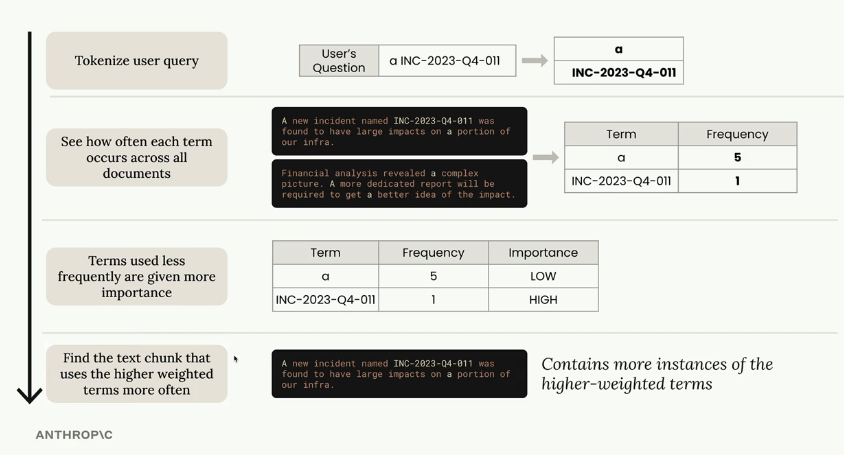

RAG - Retrieval Augmented Generation

- Hard limit on how much text we can feed into Claude.
- Larger prompts cost more to process
- Larger prompts take longer to process

Pros
- focus only on the most relevant content
- scales up to very large docs and multiple docs
- Smaller prompt, which costs less and runs faster

Cons
- Requires a pre-processing step
- Need some searching mechanism to find "relevant" chunks
- Included chunks might not contain all the context that Claude needs
- Many ways to chunk the text - which is best?

### Text chunking strategies
1. Size Based
  - Divide the text into strings of equal length
  - Include overlap on each side of the chunk to include some context
  - Easy to implement but might break up related content into separate chunks
  
  Cons
  - Each chunk has some cutoff text
  - Each chunk lacks context
  
  To overcome cutoff text and lacking context - size based chunking with overlapping
  
2. Structure Based
  - Divide the text based upon the structure (headers, paragraphs, sections)
  - Avoides breaking up related content into multiple chunks
  - Requires us to understand the structure of the document beforehand
  
3. Semantic Based
  - Divide the text into groups of related sentences or sections
  - Requires us to understand the meaning of individual sentences
  - Computationally expensive, but more relevant chunks

### Text embeddings
- Semantic search
  - Utilize text embeddings to better understand the user's question and what each chunk of text is really talking about.
- Text embedding
  - A numerical representation of the meaning contained in some text
  - Each number is a score of some quality of the input text.
  - Anthropic doesn't provide embedding generation. The recommended embedding provider is Voyage AI Embedding Model.

### The Full RAG flow
- Cosine Similarity

- Cosine distance
  - calculated as 1 - similarity
  - Same direction 0.0
  - If perpendicular 1.0
  - If completely opposite 2.0

### BM25 Lexcial search
Semantic search (Embeddings + Vector DB)

Lexical Search (classic text search)

Many methods to implement text search, but BM25 is commonly used in RAG pipelines
BM25 = Best Match 25. 25 means this was the 25th variation of the formula developed by the original creators.

Process of BM25
- Tokenize user query
- See how often each term occurs across all documents
- Terms used less frequently are given more importance
- Find the text chunk that uses the higher weighted terms more often

