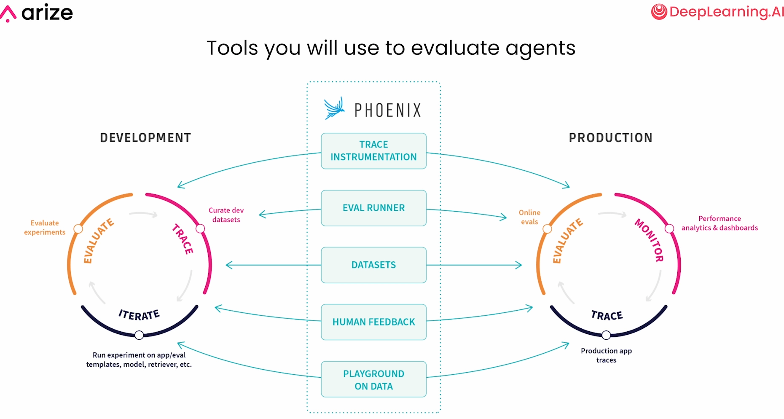

Evaluating AI Agents - https://learn.deeplearning.ai/courses/evaluating-ai-agents/
https://deepeval.com/
https://arize.com/

Evaluation Driven development

Evaluate the quality of each step's output

Scope of evaluation
- LLM Model Evaluation
  - General language understanding of the foundational models
  - Benchmark datasets -> LLM
  - Eg: MMLU (Multiple choice questions covering math, philosophy, medicine)
- LLM System Evaluation
  - Evaluate how well the entire application, including the LLM, performs
  - Testing datasets -> LLM based application

LLM based applications
Input: user's query
LLM based application: prompt, llm, memory, tools, data sources
Output: response

How different it is from traditional software testing?
- Traditional software is deterministic
- LLM based applications are non-deterministic. Outputs can vary even with the same inputs
- Look for relevance and coherence.

Common types of evaluations for LLM systems
- Hallucinations
- Retrieval relevance
- Q&A on retrieved data
- Toxicity
- Summarization performance
- Correctness

LLM based applications: agents
- Agents use LLMs for reasoning
- Agents take action on behalf of the user

Agent has 3 components
- Reasoning: powered by LLMs
- Routing: interpreting request and determining the correct tool
- Action: executing code/tools

Main components
1. Router
  - Main planner of the agent
  - Can be an LLM with function calling, an NLP classifier or rules based code
2. Skills
  - Skill is a chain of individual logic blocks that can complete a task
  - Made up of individual steps
    - LLM calls
    - Application code
    - API calls
  - Eg: RAG skill: embed input query, vector db lookup, llm call with retrieved context
3. Memory and State
  - Retrieved context
  - Configuration variables
  - Previous agent execution steps

Sample agent: A data analysis assistant
  - usecase: this agent can help to understand sales data from each of the stores
  - skills/tools
    - data lookup skill to query from the db -> prepare db -> generate sql -> execute sql -> return response to router
    - data analysis skill to draw conclusions from the data -> generate analysis -> return response to router
    - data visualization skill to generate graphs and visualizations about data -> generate chart config -> generate python code based on config -> return response to router
