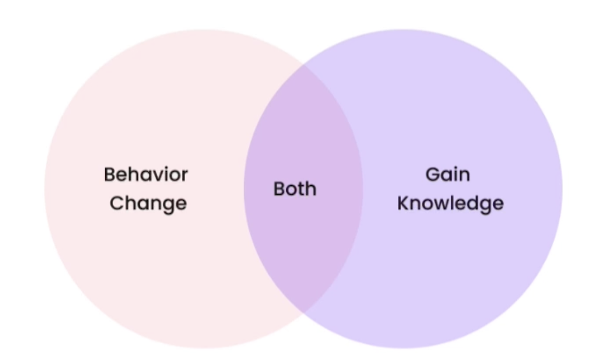

Finetuning LLMs course - https://learn.deeplearning.ai/courses/finetuning-large-language-models/lesson/1/introduction

https://www.lamini.ai/
https://www.eleuther.ai/

### Why finetune

**What is finetuning?**

- Taking general purpose models like gpt-3 and specializing them into something
  like chat gpt


**What does finetuning do for the model?**

- Put more data into the model than what fits into the prompt
- Gets the model to learn from the data, rather than just get access to it.
- Steers the model to more consistent outputs
- Reduces hallucinations
- Customizes the model to a specific use cases
- Finetuning process is similar to the model's earlier training

**Prompt Engineering vs Finetuning**


**Benefits of finetuning your own LLM**


**Tools to finetune used in the course**

- Pytorch (Meta)
- Huggingface
- Llama library (Lamini)

### Where finetuning fits in

**Pretraining**

- Pretraining gets the base model


- Open-source pretraining data -> The Pile
- Expensive & time-consuming to train

Limitations of pretraining

- it doesn't give a chatbot experience

eg: Base model training data
Q) What's the capital of India?
Q) What's the capital of Kenya?
Q) What's the capital of France?

I/P: What is the capital of Mexico? -> LLM -> O/P: What is the capital of Hungary?

**Finetuning after pretraining**

- Finetuning refers to training further

  - the data can either be self-supervised unlabelled data or curated labeled data
  - much less data is needed
    

- Finetuning for generative tasks is not well defined:
  - updates the weights of the entire model, not just part of the model
  - same training objective: next token prediction. All we are doing is changing
    the data so that it's more structured and the model can be more consistent to ouput
    and mimick that structure.

**What is finetuning doing for the model?**



- Behavior change
  - Learning to respond more consistently
  - Learning to focus eg: moderation
  - to be better at conversation
- Gain knowledge
  - increasing knowledge of new specific concepts
  - correcting old information

**Tasks to finetune**

- Text in text out
  - Extraction: text in, less text out
    - Reading
    - keywords, topics, routing, agents (planning, reasoning, self-critic)
  - Expansion: text in, more text out
    - Writing
    - Chat, write emails, write code

**First time finetuning**

1. Identify task(s) by prompt-engineering a large LLM
2. Find tasks that you see an LLM doing Ok at
3. Pick one task
4. Get ~1000 inputs and outputs for the task
5. Finetune a small LLM on this data

### Instruction finetuning

- A variant of finetuning that enabled GPT-3 to turn into Chat GPT
- other names: instruction tune or instruction following LLMs
- Teaches model to behave more like a chatbot
- Better user interface for model interaction

**Datasets**

- FAQs
- Customer support conversations
- Dialog datasets/instruction response datasets
- Convert existing data into Question and Answer dataset

- Alpaca from Stanford will use ChatGpt to prepare data

**Instruction Finetuning Generalization**

- Teaches new behavior to the model
- Generalize following instructions to other data, not in finetuning dataset

Iterative Steps

1. Data preparation
2. Training
3. Evaluation

### Data Preparation

- Higher quality data
- Diversity
- Real data but not generated
- More data is better

**steps to prepare data**

1. collect instruction-response pairs
2. concatenate pairs
3. tokenize: pad, truncate
4. split into train/test

**tokenizing**

- text data -> numbers that represent each of the pieces of the text
- Use the tokenizer associated with your model

```python
from transformers import AutoTokenizer

tokenizer = AutoTokenizer.from_pretrained("EleutherAI/pythia-70m")
text = "Hi, how are you?"
encoded_text = tokenizer(text)["input_ids"]
print(encoded_text)

decoded_text = tokenizer.decode(encoded_text)

```

**padding**

- the tokens can be in varying in lengths. everything in a batch is same length.
- padding helps to maintain same lengths in a batch

```python
tokenizer.pad_token = tokenizer.eos_token
encoded_texts_longest = tokenizer(list_texts, padding=True)
print(encoded_texts_longest["input_ids"])
```

**truncate**

- models will also have max length it can handle and take in. similar to prompt length
- truncation is a strategy to make the encoded text much shorter and fit into the model

```python
encoded_texts_truncation = tokenizer(list_texts, max_length=3, truncation=True)
print(encoded_texts_truncation["input_ids"])
```

### Training Process

- Add training data
- calculate loss
- update weights

Hyperparameters

- Learning rate
- Learning rate scheduler
- Optimizer hyperparameters

epoch is a pass over your entire dataset and then load the data in batches

```python
# training using pytorch
for epoch in range(num_epochs):
  for batch in train_dataloader:
    outputs = model(**batch)
    loss = outputs.loss
    loss.backward()
    optimizer.step()
```

The code above is a low level training using pytorch. There are highlevel interfaces to train
example lamini llama interface

```python
from llama import BasicModelRunner

model = BasicModelRunner("EleutherAI/pythia-410m")
model.load_data_from_jsonlines("lamini_docs.jsonl")
model.train()
```

### Evaluation

- human evaluation
- test suites: good test data is cruicial
  - high-quality
  - accurate
  - genealized
  - not seen in training data
- elo rankings
  - like A-B test b/w multiple models

**Common LLM benchmarks**

- ARC is a set of grade-school questions
- HellaSwag is test of commonsense
- MMLU is a multitask metric covering elementary math, US History, computer science, law and more
- TruthfulQA measures a model's propensity to reproduce falsehoods commonly found online

**Error Analysis**

- Understand base model behavior before finetuning
- Categorize errors: iterate on data to fix these problems in data space

### Practical approach to finetuning

1. Figure out your task
2. Collect data related to the task's inputs/outputs
3. Generate data if you don't have enough data (use prompt template)
4. Finetune a small model (eg: 400M - 1B)
5. Vary the amount of data you give the model
6. Evaluate your LLM to know what's going well vs not
7. Colect more data to improve
8. Increase task complexity
9. Increase model size for performance

**Complexity**

- More tokens out is harder
- Reading is easier
  - Keywords, topics, routing, agents
- Writing tasks are harder
  - Chat, write emails, write code


**PEFT - Parameter Efficient finetuning**


- LoRA: Low-Rank Adaptation of LLMs

  - reduces the number of parameters, weights we have to train
  - eg: for gpt3, 10000x less
  - slightly below accuracy to finetuning
  - same inference latency
  - Train new weights (LoRA weights) in some layers, freeze main weights

    - new weights: rank decomposition matrices of original weights' change
    - At inference, merge with main weights

  - Use LoRA for adapting to new, different tasks

    - eg: train a model with LoRA on one customer's data and then train
      another one on another customer's data and then be able to merge them
      each in at inference time when we need them.

    https://www.youtube.com/watch?v=ml2xMeftEG4
    https://learn.microsoft.com/en-us/ai/playbook/technology-guidance/generative-ai/working-with-llms/fine-tuning
    https://wow.groq.com/lpu-inference-engine/
    Prompt hydrating
    agent.ai
    Elethuer AI
