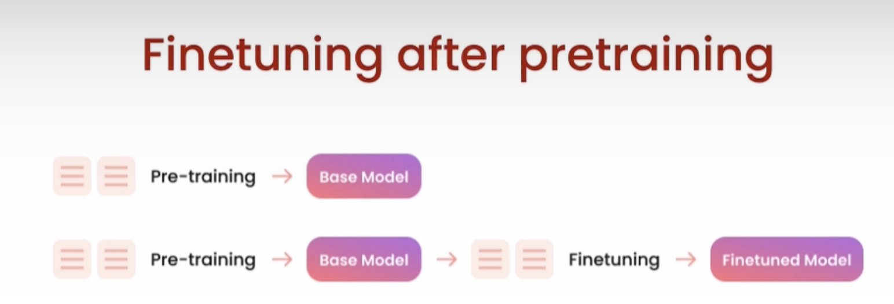

Finetuning LLMs course - https://learn.deeplearning.ai/courses/finetuning-large-language-models/lesson/1/introduction

https://www.lamini.ai/
https://www.eleuther.ai/

### Why finetune

**What is finetuning?**

- Taking general purpose models like gpt-3 and specializing them into something
  like chat gpt

**What does finetuning do for the model?**

- Put more data into the model than what fits into the prompt
- Gets the model to learn from the data, rather than just get access to it.
- Steers the model to more consistent outputs
- Reduces hallucinations
- Customizes the model to a specific use cases
- Finetuning process is similar to the model's earlier training

**Prompt Engineering vs Finetuning**

**Benefits of finetuning your own LLM**

**Tools to finetune used in the course**

- Pytorch (Meta)
- Huggingface
- Llama library (Lamini)

### Where finetuning fits in

**Pretraining**

- Pretraining gets the base model

- Open-source pretraining data -> The Pile
- Expensive & time-consuming to train

Limitations of pretraining

- it doesn't give a chatbot experience

eg: Base model training data
Q) What's the capital of India?
Q) What's the capital of Kenya?
Q) What's the capital of France?

I/P: What is the capital of Mexico? -> LLM -> O/P: What is the capital of Hungary?

**Finetuning after pretraining**

- Finetuning refers to training further

  - the data can either be self-supervised unlabelled data or curated labeled data
  - much less data is needed
    

- Finetuning for generative tasks is not well defined:
  - updates the weights of the entire model, not just part of the model
  - same training objective: next token prediction. All we are doing is changing
    the data so that it's more structured and the model can be more consistent to ouput
    and mimick that structure.

**What is finetuning doing for the model?**

- Behavior change
  - Learning to respond more consistently
  - Learning to focus eg: moderation
  - to be better at conversation
- Gain knowledge
  - increasing knowledge of new specific concepts
  - correcting old information

**Tasks to finetune**
