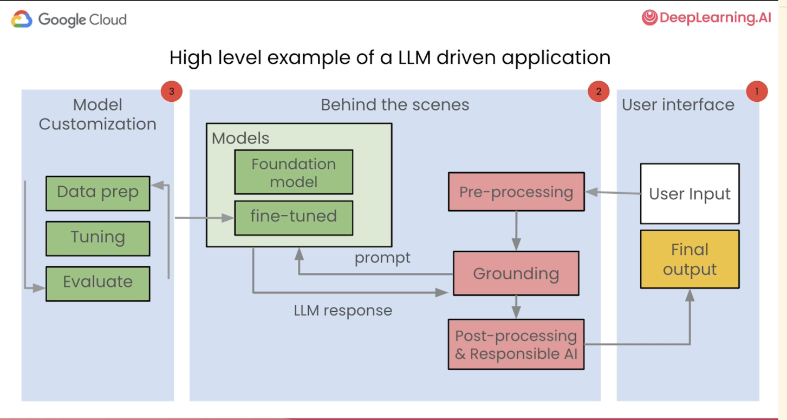
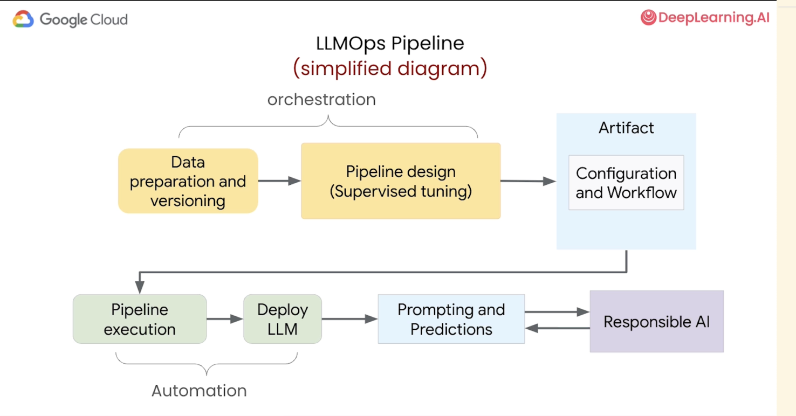

https://learn.deeplearning.ai/courses/llmops/lesson/1/introduction

Extension to ML Ops

Lifecycle

- data preparation
- model tuning
- deployment
- maintenance
- monitoring

Prompt management

Evaluating and comparing the performance of different prompts

### Fundamentals

ML Ops is an ML eng culture and practice that aims at unifying
ML development(dev) and ML operation (ops)

Automation and monitoring at all steps of ML system construction including:

- Integration
- Testing
- Releasing
- Deployment
- infra management

**ML Ops framework**

- Data ingestion
- Data validation
- Data trasformation
- Model
- Model Analysis
- Serving
- Logging

We focuss on

- Data transformation
- Model
- Serving

Per usecase, we build a workflow
One model for one use case in ML Ops

**LLM Ops**
ML Ops for LLMs (LLMOps)

- Focus on the llm development and managing the model in production

Examples

- experiment on foundation models
- prompt design and managment
- supervised tuning
- monitoring
- evaluate generative output

LLM system design

- Broader design of the entire end-to-end application - FE, BE, Data engineering etc

Examples

- Chain multiple LLM together
- Grounding: additional information
- Track history

**Example of a LLM driven application**


**LLMOps pipeline**

- Data preparation and versioning
- Pipeline design (Supervised tuning)
- Artifact (configuration and workflow)
- Pipeline exection
- Deploy LLM
- Prompting and predictions
- Responsible AI



Check

- Prompt design and prompt management
- Model evaluation
- Model monitoring
- Testing

### Data Preparation

Stack Overflow data is used
`bigquery-public-data.stackoverflow.INFORMATION_SCHEMA.TABLES`

**What is Data Lineage?**

- Process of tracking the flow of data over time
- Provides an understanding of where the data originated (data collection), how it has changed (transformation) and its destination within the data pipeline

**Benefits of data lineage**

- improved data governance: manage data compliance, privacy and security
- enhanced data quality
- regulatory compliance

**tools**

- ETL tools: informatica, talend, apache nifi include lineage tracking capabilities
- Data catalogs: Alation, collibra, Microsoft Azure data catalog provides metadata management and data lineage features
- Data Governance platforms: IBM infosphere, Ataccama, Data advantage group offer data governance and lineage tracking

**File formats train and evaluation**

- JSONL: JSON Lines is a text based format with each question and answer in a row. Human readable. For small to medium datasets
- TFRecord: Tensfor Flow record is a binary format. Ideal choice for efficient training
- Parquet: good choice for large and complex datasets

### Automation, and Orchestration with Pipelines

**MLOps workflow for LLMs**


Orchestration: steps that need to run in the order
Automation: automating the workflow
Deployment: putting the trained model and into the production environment

Apache airflow and kubeflow pipelines help in orchestration and automation

Kubeflow Pipeline has two concepts:

1. Components - each component is a step in the workflow

```
from kfp import dsl

@dsl.component
```

2. Pipelines - self contained code

### Deployment

package, deploy and versioning your model

When deploying model, we have two ways:

1. Batch
   eg: Product reviews every week
   Run the prediction in batches

2. REST API

- Deploy the model as an api
  eg: chat application like q&a

**model monitoring: metrics and safety**

- how often we send prediction to the api
- how model is performing
- is there any bias?
- load test
- controlled roll out
- latency: permissible latency
  - smaller models
  - faster processors (gpus, tpus)
  - deploy regionally

**citations**

- citationMetadata can be used to to check and reduce the chances of a LLM generating a lot existing content

**safety attributes**

- These scores can be used to make sure that the LLM's response is within the boundries of the expected behaviour.
