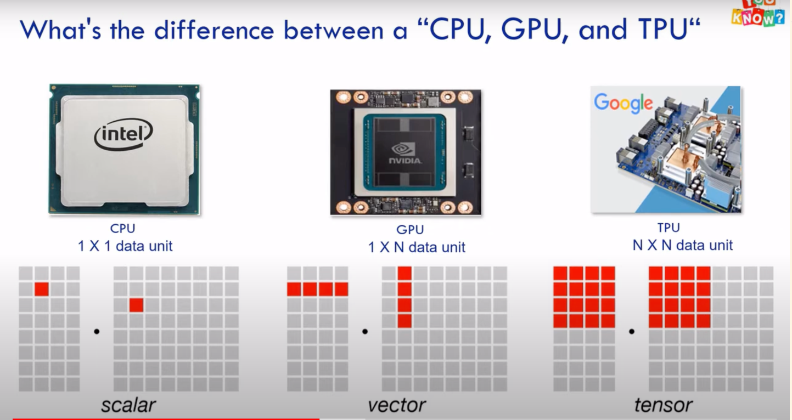

### TPU - Tensor Processing Unit

[TPUs: History and Hardware](https://www.youtube.com/watch?v=MXxN4fv01c8)

[In-Datacenter Performance Analysis of a Tensor Processing Unit](https://arxiv.org/abs/1704.04760)
Inference - running a machine learning model that has already been trained
[Google TPU & other in-house AI chips](https://www.youtube.com/watch?v=YZzROmj5Ols)
https://cloud.google.com/blog/products/ai-machine-learning/what-makes-tpus-fine-tuned-for-deep-learning

TPU is an application-specific integrated circuit (ASIC) designed by Google for neural networks.

**TPU v1**

- The first TPU was build as a PCI express expansion card
- 700 mhz clock speed
- 40 watts power consumption
- Had a much higher performance per watt of energy
- Domain specific architecture for Deep Learning
- Utilized:
  - reduced precision
    - quantization: reducing precision
  - matrix processor
    - systolic array
- Can do only prediction

**Quantization: Reducting Precision**

- Reduced the precision of the chip, using 8-bit integers rather than
  the conventional 32 bit floating point numbers
- Using quantization technique, convert 32 floating point numbers to 8-bit integers

**Systolic Array**

- Large hard-wired matrix calculation without memory access]
- At first tpu loads the parameters from memory into the matrix of multipliers
  and adders then the tpu loads the data from memory, as each multiplication is
  executed the result will be passed to next multipliers while taking summation
  at the same time. so the output will be the summation of all multiplication result
  between data and parameters. During this whole process of calculation and data passing
  no memory access is required at all. So, the tpu can achieve high computational throughput
  on neural network calculations with much less power consumption

[TPU v2 and v3](https://www.youtube.com/watch?v=kBjYK3K3P6M)

### TPU v2

- 4 chips instead of 1
- head sinks
- 180 tflops (terraflops) - 180 trillion floating pointing ops per second
- can do both training and prediction/inference
- Each board has 4 chips, but each chip has 2 cores
- Each core then contains a matrix unit, a vector unit and a scalar unit all
  connected to 8 gb of highbandwidth memory
- Which mean each board has 8 cores (4\*2) and 64 gb of memory (4\*2\*8)
- Matrix unit is a 128x128 systolic array
- New datatype bfloat16: combines the range of a 32 bit fp with just storage space of a 16-bit fp number
- b means brain, it comes from google brain team
- precision is lost
- tpuV2 also included networks links, allowing Google to combine up to 256 chips into a single AI
  supercluster, called TPU pods

- TPU v2 are arranged as pods
- One TPU v2 pod is 64 TPUs
- They are all connected together and use entire pod as if it is a one machine
- For one pod there are 64\*8 = 512 cores, 11 petaflops

### TPU v3

- water coolants reducing vertical space
- tpu v3 pods can support many tpus in a single pod
- full tpu v3 pod is 8 times faster than a v2 pod
- over 100 petaflops

LPU - Large scale processing unit

### TPU v4 & TPU4i

- v4 is for both training and inference
- 4i is only for inference

### cpu gpu tpu

[cpu, gpu, tpu](https://www.youtube.com/watch?v=6ZDoFomU10A)

- when we say processing units, it's all computing power to teach machines to think like human

- cpu handles matrix multiplications in a form of scalar (1 x 1) operations and it can handle tens of operations per cycle
- gpu handles matrix multiplications in a form of vector (1 x N), it can handle tens of thousands of ops per cycle
- tpu in form of tensor (n x n), can handle hundreds of thousands of ops per cycle
  

- mnist data set
- each number is an image of 28x28 grayscale pixels
- converted to a vector of 784 values called dimensions
- neurons that recognize the digit eg: 8 takes those values and multiply by the parameter values
- the parameter works as a filter to extract the feature from the data that tells the similarity

**cpu**

- fast general purpose processor based on the one newman architecture
- means, a cpu works with s/w and memory
- cpu has to store the calculation results on memory for every calculation
- this memory access becomes the downside of cpu architecture called **one newman bottleneck**
- each cpu's ALUs executes them one by one accessing the memory everytime limiting the throughput and consuming
  significant energy
- on the other side, cpu is powerful because it can run millions of different applications by changing the s/w

**gpu**

- To gain higher throughput than a cpu, a gpu uses thousands of ALUs in a processor
- Modern gpus have 2500 to 5000 in a processor
- Both cpu and gpu read and write the intermediate result to memory at every calculation
- gpu also run into one newman bottleneck
- for every single calculation in the thousand of ALUs, gpu needs to access registers or shared
  memory to read and store intermediate results

**tpu**

- Gogole designed the tpu to build a Domain specific architecture
- Matrix processor specialized for neural network workloads
- Fast matrix calculations with comparitively less power consumption

### What is a Tensor?

https://www.youtube.com/watch?v=L35fFDpwIM4

- Within ml community, Tensors are used in conjunction with Neural Networks.

### Custom AI chips in AWS

- Acquired Israel based startup Annapurna labs
- For inference called Inferential
- For training Trainium

### Microsoft

- Project Athena

### Tesla

- Dojo D1

### Nvidia

**Black Wheel B200 GPU**

**H100**

**A100**

- Architecture: Ampere
- Optimized for both training and inference
- Tensor cores
- Suitable for large scale deep learning training and inference
- High performance computing (HPC)

**V100**

- Architecture: Volta
- Tensor cores for deep learning, high memory bandwidth
- NVLink for high speed connect
- AI training and inference, HPC

**T4**

- Architecture: Turing
- Tensor cores, energy efficient
- for both inference and lightweight training
- video transcoding

**Titan Rtx**

- Architecture: Turing
- Tensor cores
- AI r&d

### Misc

- Coral AI Edge TPU

### Training and Inference

**Training**

- Training involves updating the model parameters based on the input data
- Computationally intensive and requires a lof of parallel processing power
  to handle large datasets and complex models efficiently

**Inference**

- Inference is the process of using a trained model to make predictions.
- Less computationally demanding
