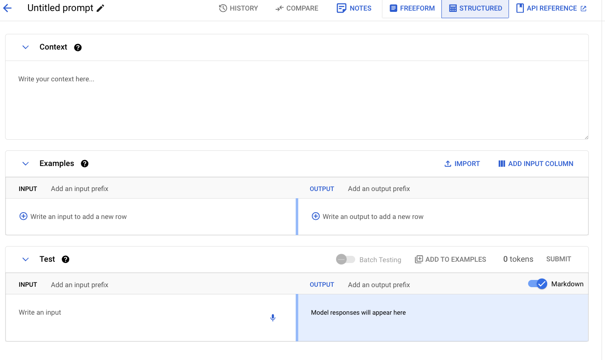
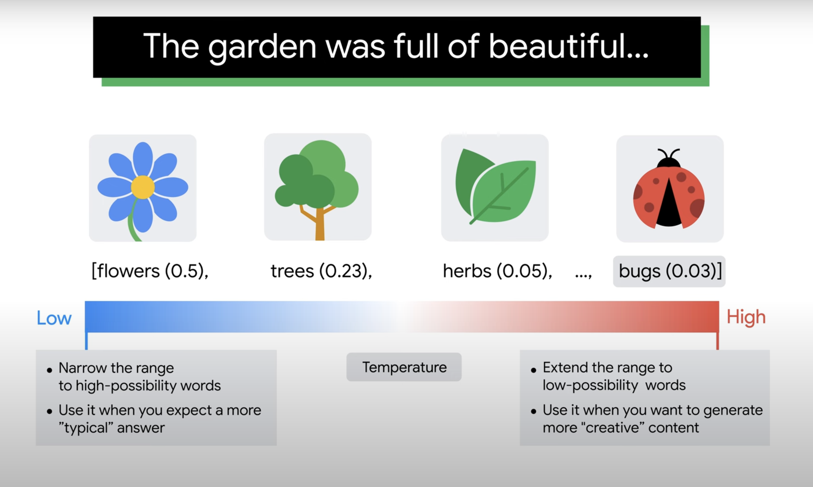
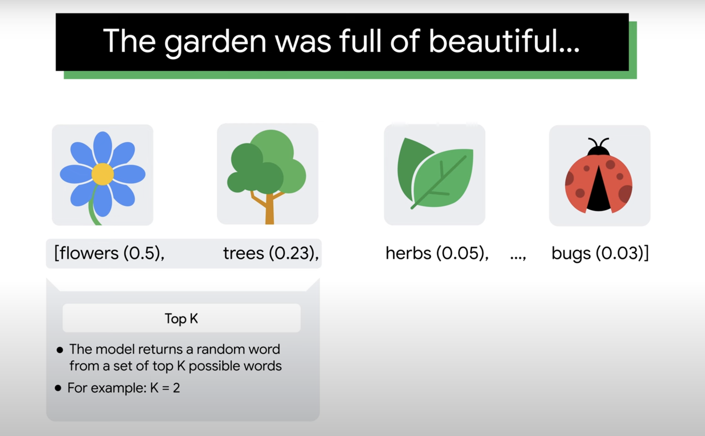
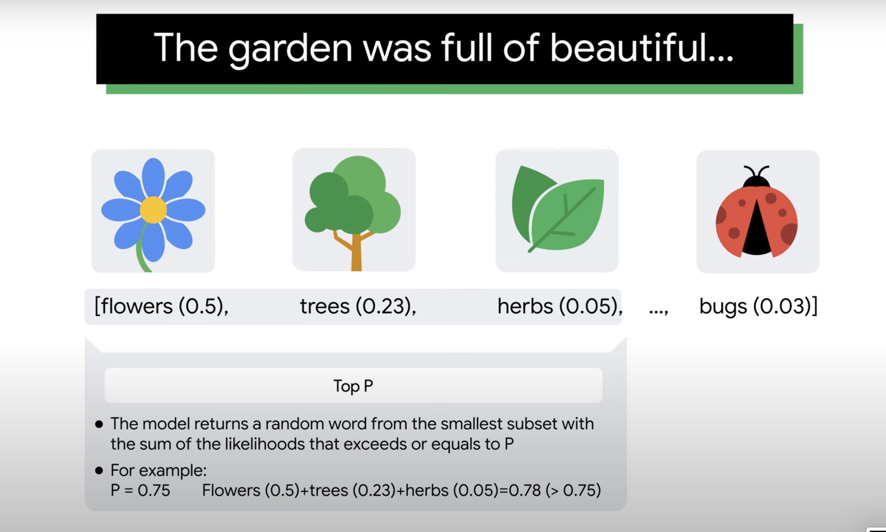
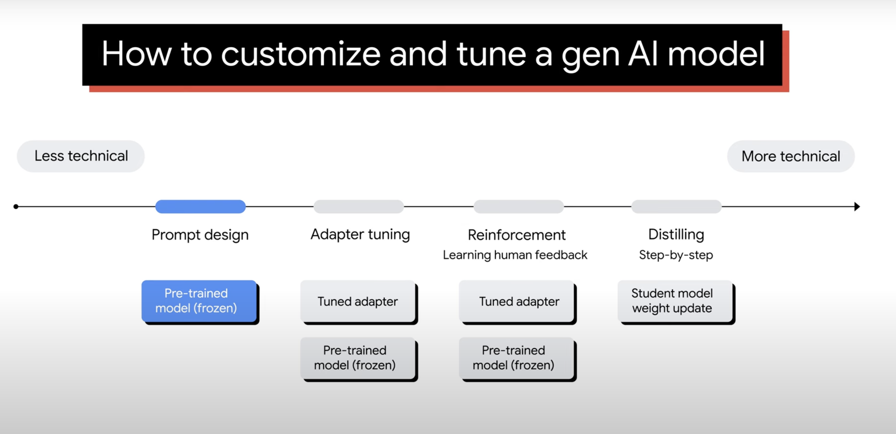

Source: https://www.cloudskillsboost.google/course_templates/552/

### Vertex AI studio course

- tool to access Google's generative AI models
- it facilitates
  - testing
  - tuning
  - augmenting
  - deploying

### course overview

- Generative AI workflow
- Gemini multimodal
- Prompt design
- Model tuning

### Intro

**How does AI generate new content?**

- learns from a massive amount of existing content inclues: text, image and video. This process is called training
- results in the creation of a foundational model
- a foundation model is usually a large model interms of number of parameters, size of training data and high requirements
  computational power
- an llm like PaLM - Pathways Language Model is an example for foundational model
- models from Google:
  - PaLM for language generation
  - Gemini for multimodal processing
  - Codey for code generation
  - Imagen for image processing

How can we use the foundation models to power our applications?
and
How can we further train or tune the foundation model to solve a problem in a specific field?

### Vertex AI

- comprehensive machine learning platform by gcp
- supports end-to-end ML processes:
  - model creation
  - deployment
  - management
- vertex ai provides two primary capabilities:
  1. Predictive AI
  - we can build ML models for forecasting
  2. Generative AI
  - we can use and tune gen AI models to produce content

**Genreative AI workflow on Vertex AI**

### Gemini Multimodal model

**What is a multimodal model?**

- Large foundational model that is capable of processing information from multiple modalities including
  text, image and video.
- The generated content can also be in multiple modalities

**What is a prompt?**

- A prompt is a natural language request to a model to receive a response

**Anatomy of a prompt**

- input (required): represents a request to get a response from the model
  eg: question input, task input, partial input, completion input
- context (optional):
  - instructions that specify how the model should behave
  - information that the model references
    eg: you are the IT help desk. Please consistently advise users to restart
    their computers, regardless of the nature of their inquiries.
- examples (optional): input-output pairs to illustrate the model of an ideal response
  - incorporating examples in the prompt is an effective technique for tailoring the response format

### Prompt design

- The process of designing the input text to get the desired response back from the model

The Temperature setting controls the degree of randomness in the response, with 0 being the most expected answer
and 1 being the most creative

The safety setting allows to adjust the likelihood of receiving a response that could contain harmful content.
Content is blocked based on the probability that it's harmful.

There are 3 methods we can use to shape the model's response in a way that you desire

1. Zero-shot prompting

- Writing a single command so that the model can adopt a certain behavior is called zero-shot prompting
- Prompting without any example of the task to the LLM

2. One-shot prompting

- Where the LLM is given a single example of the task
  eg: if we want the LLM to write a poem, you might provide a single example poem

3. Few-shot prompting

- Where the model is given a small number of examples
  eg: if we want the model to write a news article we might give it a few news articles to read

Structured prompt

**Vertex AI Studio: Language**

- Design a prompt
- Start a conversation
- Tune a model

The structured prompt allows to give context and examples to use for all future inputs

**Model Parameters**

- Temperature: number used to tune the degree of randomness

  - low temperature means to narrow the range of possible words, that have high possibilities
  - high temperature means extend the range to low-possibility words and are more unusual.
    Used to generate unusual/creative responses
    

- Top K (number)

  - top K lets the model randomly return a word from the top K number of words interms of possibility
  - if the probability distribution of the words is highly skewed and if you have one word that is very
    likely and everything is very unlikely this approach can result in some strange responses
    

- Top P (probability)
  - dynamically sets the size of the short list of words
  - Allows the model to return a random word from the smallest subset with the sum of the likelihoods
    that exceeeds or equals to P
    

### Model tuning

- Is there a way to improve the quality of responses beyond just prompt design?

**How to customize and tune a gen AI model?**

1. Prompt Design

- Doesn't change any parameters of the pre-trained model. It improves
  the model's ability to respond appropriately by teaching it how to react
- Doesn't require ML background nor coding skills
- Model responses to prompt aren't consistent. One way to address this issue is to
  tune the models using our own data
- Fine tuning the entire model can be impractical due to the high computational
  resources, cost and time required.
- Instead parameter efficient tuning can be used, this includes
  - training a subset of parameters or
  - adding additional layers and embeddings

2. Adapter tuning
   Tuned adapter
   Pre-trained model (frozen)

   - Supervised tuning lets us use as few as 100 examples to improve model performance

3. Reinforcement learning from human feedback (RLHF)
   Tuned adapter

   - Reinforcement tuning which is unsupervised reinforcement learning with human feedback

4. Distilling (step-by-step)

- Distilling enables training smaller task-specific models with less training data, lower
  serving costs and latency than the original model
- Exclusive to Google cloud
- Transfer knowledge from a larger model to a smaller model to optimize performance (high perf),
  latency (lower cost and latency at serving), and less training data is required.
- A large teacher model trains smaller student models to perform specific tasks better and with improved
  reasoning capabilites
- The training and distilling process uses labeled examples and rationales generated by the teacher model
  to fine tune the student model
- Rationales are like asking the model to explain why examples are labeled the way they are

**model tuning on vertex AI studio**

Vertex AI -> Language -> Tune a model

- Training data should be structured for supervised tuning in a JSON file
- Each row contains a pair of text data:
  input_text: prompt
  output_text: expected response from the model
- Tuned model can be found in the vertex ai model registry

### Resources

[Scaling Down to Scale Up: A Guide to Parameter-Efficient Fine-Tuning](https://arxiv.org/pdf/2303.15647)
