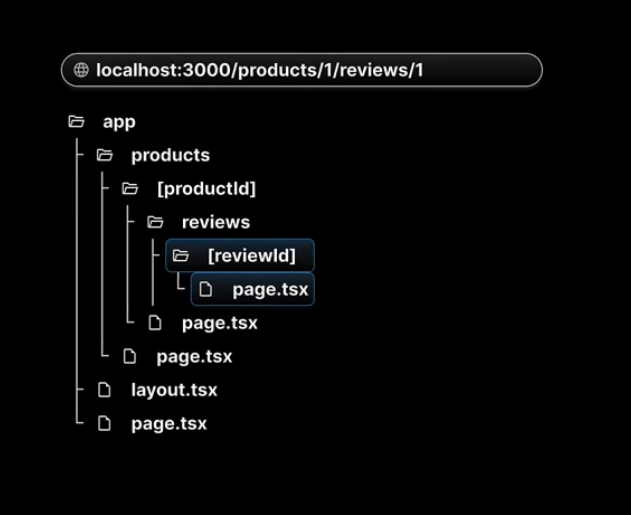

## May 9, 2024 - Thursday

```
nvm use v19.8.1
npx create-next-app@latest .

npm run dev
```

Youtube playlist - https://www.youtube.com/watch?v=ZjAqacIC_3c&list=PLC3y8-rFHvwjOKd6gdf4QtV1uYNiQnruI

NextJS is a React framework to build web apps

**React**

- not feasible to production ready web apps
- React is a library to build user interfaces
- We need to pick up different tools for routing, data fetching etc.

**Next.js**

- to build production ready apps
- features including routing, data fetching, bundling and compiling
- opinions and conventions should be followed

- simplifies the process of building a web application for production

1. Routing
2. API routes
3. Rendering - supports both server side rendering and client side rendering
4. Simplified data fetching
5. Styling
6. Optimization for images, fonts, scripts
7. Dev and prod build system

**Flow of control**

- layout.tsx -> RootLayout component is rendered
- localhost:3000 -> children prop will always refer to the component defined in page.tsx

**React Server Components (RSC)**

- React server components is a new architecture introduced in version 18 embraced by NextJS
- RSC introduces a new way of creating React components, splitting them into two types:
  - server components
    - all components by default are server components
    - server components can run tasks like reading files, fetching data from database
    - cannot use hooks or handle user interactions
  - client components
    - add `use client` at the top of the component file to create a client component
    - can't perform tasks like reading files and reading data form db
    - can use hooks and manage interactions
    - traditional react components

### Routing

- NextJS has a file-system based routing mechanism
- URL paths that users can access in the browser are defined by files and folders in your codebase

**Routing conventions**

- All routes must be placed inside the app folder
- Every file that corresponds to a route must be named `page.js` or `page.tsx`
- Every folder corresponds to a pth segment in the browser URL

**Nested Routes**

- Achieved using nested folders

**Dynamic Routes**

- Products listing and detailed page

```
/products
/products/1

products/[id]
```

Every page receives route parameter as a prop

```
export default function ProductDetails({params}) {
  return (
    <>
    <h1>Product List {params.productId}</h1>
    </>
  )
}
```

**Nested Dynamic Routes**

```
/products/1
/products/1/reviews/1

reviews folder in [productID]
```



**Catch-all Segments**

- captures all url segments and maps them to single file `page.tsx`

**Custom 404 page**

- create `not-found.tsx` in `app` directory
- `notFound()` function
- `import {notFound} from "next/navigation";`
- we can create `not-found.tsx` at route specific folders

### File Colocation

- until we have a `page.tsx` file in the folder, it is not publicly accessible
- only the content in `page.tsx` is sent to the client

**Private folders**

- A private folder indicates that it is a private implementation detail and should not be considered by the routing system
- The folders and all its subfolders are excluded from routing
- Prefix the folder name with an underscore
- Useful
  - For separating UI logic from routing logic
  - For consistently organizing internal files across a project
- If you want to include an underscore in URL segments, you can prefix the folder name with `%5F` which is the URL encoded form of an underscore.

### Route Groups

- Allows us to logically group our routes and project files without affecting the URL path structure
- Authentication routes
  - Register
  - Login
  - Forgot Password
- All routes are put in `auth` folder in `app` folder.
- Wrap `auth` in paranthesis `()`. It looks like `(auth)`. NextJS will omit `auth` from the URL.
